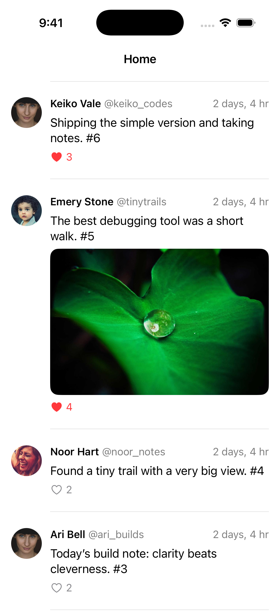

# Chirpy

Chirpy is a small social-feed iOS app for practicing modern iOS development. It is a fun sandbox for SwiftUI, Swift
concurrency, networking, pagination, caching, and testing.

This repo contains both the iOS app and its lightweight Supabase backend. The app talks to a single Edge Function using
plain HTTP and JSON.

<p align="center">
  
</p>

## What it does

- Shows a reverse-chronological feed
- Loads more posts with cursor pagination
- Likes and unlikes posts
- Keeps a local feed snapshot around for a faster launch and an offline fallback
- Refreshes with pull-to-refresh

The project intentionally skips accounts, post creation, replies, follows, search, notifications, and realtime updates.

## Run the app

You will need a recent Xcode version that supports the project's iOS 26.5 deployment target.

First, get the local backend running using the steps below. Then open `Chirpy/Chirpy.xcodeproj`, choose an iPhone
Simulator, and hit Run. The app is already set up to talk to Supabase at `http://127.0.0.1:54321`.

That address works from the Simulator. If you want to run Chirpy on a physical device, update the URL in
`Chirpy/Chirpy/AppConfiguration.swift` to your Mac's local network address and make sure the phone can reach it.

## Run the backend locally

You will need Docker, Supabase CLI 2.x, and Deno 2.x.

Start Supabase and build a fresh seeded database:

```sh
supabase start
supabase db reset
```

Create the local function environment file:

```sh
cp supabase/functions/.env.example supabase/functions/.env
supabase status
```

Fill in these values in `supabase/functions/.env`:

| Name                        | Local value                                       |
| --------------------------- | ------------------------------------------------- |
| `SUPABASE_URL`              | `http://127.0.0.1:54321`                          |
| `SUPABASE_SERVICE_ROLE_KEY` | The local service-role key from `supabase status` |
| `DEMO_USER_ID`              | `00000000-0000-4000-8000-000000000001`            |
| `ENABLE_DEV_SCENARIOS`      | `true`                                            |
| `ALLOWED_ORIGIN`            | Optional; usually blank for the iOS app           |

Never add the service-role key to the iOS app or commit `.env` files.

Serve the API:

```sh
supabase functions serve social-feed --env-file supabase/functions/.env --no-verify-jwt
```

## Try the API

```sh
curl http://127.0.0.1:54321/functions/v1/social-feed/health
curl 'http://127.0.0.1:54321/functions/v1/social-feed/feed?limit=20'

curl -X POST \
  http://127.0.0.1:54321/functions/v1/social-feed/posts/10000000-0000-4000-8000-000000000001/like

curl -X DELETE \
  http://127.0.0.1:54321/functions/v1/social-feed/posts/10000000-0000-4000-8000-000000000001/like
```

Handy development feeds:

```text
/feed?scenario=slow
/feed?scenario=error
/feed?scenario=empty
/feed?scenario=duplicates
```

These only work when `ENABLE_DEV_SCENARIOS=true`.

## Run the backend tests

```sh
deno task test
deno task check
deno fmt --check
deno lint
```

## Run the iOS tests

Open the project in Xcode, pick an iPhone Simulator, and use **Product › Test** (`⌘U`). The test suite covers feed state,
pagination, networking, and snapshot persistence.

## A quick note on pagination

Posts are ordered by `created_at DESC, id DESC`. Each response includes an opaque `nextCursor`; pass it back unchanged to load the next page. The API uses keyset pagination, including UUID tie-breaking for posts with identical timestamps.

## Deploy the backend

```sh
supabase login
supabase link --project-ref YOUR_PROJECT_REF
supabase db push
supabase functions deploy social-feed --no-verify-jwt
supabase secrets set --env-file path/to/production.env
```

Keep development scenarios disabled in production. `supabase db push` does not run `seed.sql`, so seed a hosted demo
project separately only if you want the fictional content there.
