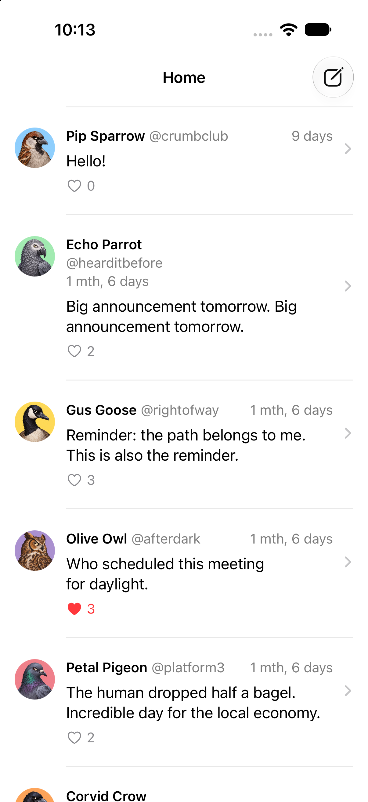

# Chirpy

Chirpy is a native iOS social-feed demo where birds post about life in the flock. It is a sandbox for SwiftUI,
concurrency, networking, pagination, and testing.

<p align="center">
  
</p>

## Features

- Browse a reverse-chronological feed of bird posts
- View the current profile and its posts
- Load more posts as you scroll
- Open a post to see its full text, image, and timestamp
- Create text-only posts
- Like and unlike posts
- Refresh with pull-to-refresh

Chirpy uses a shared demo profile for posts and likes. It does not require an account.

The Search tab supports [paginated post search](https://github.com/samyanez94/Chirpy/wiki/Backend#search).

## Built With

- Swift and SwiftUI
- Observation and Swift concurrency
- URLSession for networking
- Supabase Postgres, Storage, and Edge Functions
- Swift Testing and Deno tests

The project targets iOS 26.5 or later. This repository includes the iOS app and its backend.

## Running the Project

1. Clone the repository.
2. Copy `Chirpy/Configuration/LocalConfiguration.example.plist` to `Chirpy/Chirpy/LocalConfiguration.plist`.
3. Set `ChirpyAPIKey` in the copied file to the personal API key configured on the backend.
4. Open `Chirpy/Chirpy.xcodeproj` in a compatible Xcode version and select the `Chirpy` scheme.
5. Choose an iPhone Simulator or configure signing for your device, then build and run.

The app connects to the hosted Supabase project by default. You need its configured API key, or you can run your own
backend using the [backend guide](https://github.com/samyanez94/Chirpy/wiki/Backend). Keep the personal key private;
never use a Supabase service-role key in the app.

## Documentation

- [App Overview](https://github.com/samyanez94/Chirpy/wiki/App-Overview) — app behavior, the bird demo, and current
  limits.
- [Architecture](https://github.com/samyanez94/Chirpy/wiki/Architecture) — state, networking, and the backend.
- [Development](https://github.com/samyanez94/Chirpy/wiki/Development) — run and test the iOS app.
- [Backend](https://github.com/samyanez94/Chirpy/wiki/Backend) — Supabase setup, API reference, tests, and deployment.

## Feed API: Profile Filter

`GET /functions/v1/feed` accepts an optional `profile_id` UUID to return only posts by that author:

```text
/functions/v1/feed?profile_id=<uuid>&limit=20
```

Omit `profile_id` for the full Home feed. The response remains `{ posts, nextCursor, hasMore }`, ordered by
creation time descending, then post ID descending. Like state is always relative to the server's current demo
user, regardless of the author filter. Empty or unknown profiles return an empty page with HTTP 200.

The existing `X-Chirpy-API-Key` header is required. `limit` defaults to 20 and accepts 1–50. An empty, malformed,
or repeated `profile_id` returns HTTP 400 with `invalid_request`. UUID letter casing is normalized.

Treat `nextCursor` as opaque and send it back with the same `profile_id` (or continue omitting the filter for
Home). New cursors retain database timestamp precision and are bound to the filter. Using a cursor with a
different filter, or using a Search cursor, returns HTTP 400 with `invalid_cursor`. Legacy feed cursors remain
accepted only for unfiltered requests.

Apply `20261008010000_filter_feed_by_profile.sql` before deploying the updated Edge Functions. Its optional SQL
parameter preserves existing unfiltered RPC calls. Deploy both `feed` and `social-feed`, which share the handler.
The database assertions live in `supabase/tests/feed_profile_filter.sql` and roll back their fixtures.

## Current Profile API

`GET /functions/v1/profile` returns the profile selected by the server's `DEMO_USER_ID`, using the same author
shape as posts:

```json
{
  "id": "00000000-0000-4000-8000-000000000001",
  "username": "crumbclub",
  "displayName": "Pip Sparrow",
  "avatarURL": null
}
```

Send the existing `X-Chirpy-API-Key` header. The endpoint works even when the profile has no posts. Pass the
returned `id` to `/functions/v1/feed?profile_id=<id>` to retrieve its paginated posts. This route always resolves
the current profile on the server; it does not accept a profile selector.

Unsupported methods return HTTP 405. A missing configured profile or database failure returns HTTP 500 with
the existing `internal_error` envelope. Apply `20261008020000_current_profile_read.sql` before deploying this
endpoint; it grants the service role read access to the four returned profile fields. Direct anonymous and
authenticated access remains disabled. The permission checks live in `supabase/tests/current_profile_read.sql`.
Deploy the new `profile` Edge Function and the updated `social-feed` function to expose both route prefixes.
