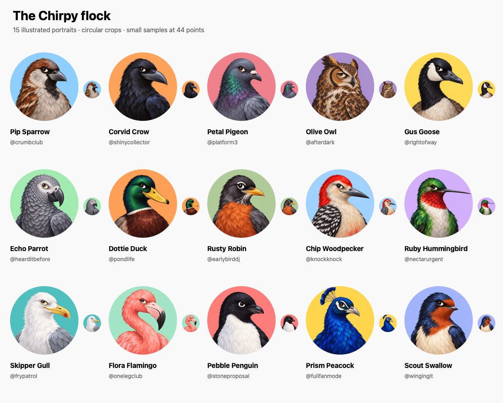
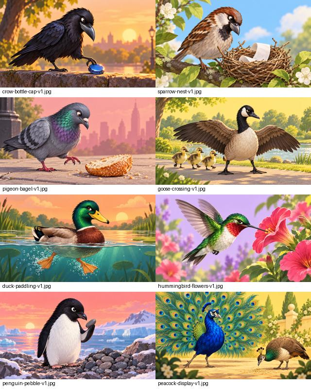

# Chirpy bird artwork

These are publishing sources for Supabase Storage, **not iOS bundle resources**. The app continues to load
`author.avatarURL` through `AsyncImage`. Every portrait uses the approved crow as a visual reference, matching its
painterly feather treatment, expressive face, head-and-chest framing, and solid-color background.

The 15 final portraits are in [`avatars/`](avatars/), as 512 × 512 JPEGs at quality 85. The generation tool was the
built-in `image_gen`; each final prompt is recorded in [`avatar-prompts.json`](avatar-prompts.json). The original crow
is the style reference for future additions. Keep each species recognizable rather than simply recoloring the crow.



| Species                   | Profile          | Handle          |
| ------------------------- | ---------------- | --------------- |
| House sparrow             | Pip Sparrow      | @crumbclub      |
| Crow                      | Corvid Crow      | @shinycollector |
| Pigeon                    | Petal Pigeon     | @platform3      |
| Great horned owl          | Olive Owl        | @afterdark      |
| Canada goose              | Gus Goose        | @rightofway     |
| African grey parrot       | Echo Parrot      | @hearditbefore  |
| Mallard                   | Dottie Duck      | @pondlife       |
| American robin            | Rusty Robin      | @earlybirddj    |
| Red-bellied woodpecker    | Chip Woodpecker  | @knockknock     |
| Ruby-throated hummingbird | Ruby Hummingbird | @nectarurgent   |
| Herring gull              | Skipper Gull     | @frypatrol      |
| Flamingo                  | Flora Flamingo   | @onelegclub     |
| Adélie penguin            | Pebble Penguin   | @stoneproposal  |
| Peacock                   | Prism Peacock    | @fullfanmode    |
| Barn swallow              | Scout Swallow    | @wingingit      |

## Publish to the hosted demo

The project must be active and the Supabase CLI authenticated. From the repository root:

```sh
sh supabase/scripts/publish_bird_demo.sh
```

This creates the public `chirpy-avatars` bucket, uploads all 15 images, and then applies
`supabase/demo/refresh-bird-demo.sql`. That SQL only updates the known seeded profile and post IDs. It preserves post
timestamps, all existing likes, and posts created through the composer. It does not insert absent demo records; for an
empty database, seed it explicitly with `supabase/seed.sql` after applying schema migrations.

Public downloads require no API key. Client uploads are not enabled. The bucket accepts JPEGs up to 256 KiB. Versioned
object names such as `crow-v1.jpg` use a one-year cache lifetime; publish replacements under `-v2` paths and update the
generator and preview URLs instead of overwriting a cached image.

## Feed illustrations

Eight 1280 × 720 JPEG scenes live in [`posts/`](posts/). They were generated with the built-in `image_gen` using each
bird's avatar as the character and painterly style reference. The exact prompts, versioned filenames, species, and
zero-based post indices are recorded in [`post-prompts.json`](post-prompts.json). The seed generator validates these
mappings and assets, then adds public image URLs to the matching existing captions.

The public `chirpy-posts` bucket accepts JPEGs up to 1 MiB, with no client upload policies. The publishing script
creates both artwork buckets and uploads all avatars and feed illustrations before refreshing the seeded rows.
Use a new versioned filename for replacements to avoid stale one-year caches.
Identical published files are skipped; differing content at an existing path stops publishing so it can be versioned.



| Scene | Matching post |
| --- | --- |
| Crow and bottle cap | Found a bottle cap. Won’t be taking questions about my net worth. |
| Sparrow nest | Nest update: one excellent twig, three questionable twigs, and a receipt. Open concept. |
| Pigeon and bagel | The human dropped half a bagel. Incredible day for the local economy. |
| Goose crossing | The goslings crossed safely. The cyclist learned patience. A productive afternoon. |
| Duck paddling | Everything looks calm above the water. Below the water I am doing an unreasonable amount of leg work. |
| Hummingbird flowers | Visited 83 flowers before breakfast. Feeling behind. |
| Penguin pebble | Found the perfect pebble for the nest. Yes, I checked the other 400 pebbles. |
| Peacock display | Displayed for a peahen. She continued eating. Tough room. |

After editing either manifest, run `deno task demo:build`, then `deno task demo:check` before publishing.

## Local development

Apply the bucket migration with `supabase migration up --local`. A fresh `supabase db reset` also applies migrations and
loads the bird seed, but removes existing local data. To retain it, apply the targeted refresh through
`supabase db query --local --file supabase/demo/refresh-bird-demo.sql`.

The seed uses the hosted public avatar URLs even when the feed backend runs locally. Preview avatar URLs follow
`AppConfiguration.baseURL`. To test local Storage, upload the images using `supabase storage cp --experimental --local`
and change the seeded URLs to your local Storage endpoint. No account or authentication change is required.
